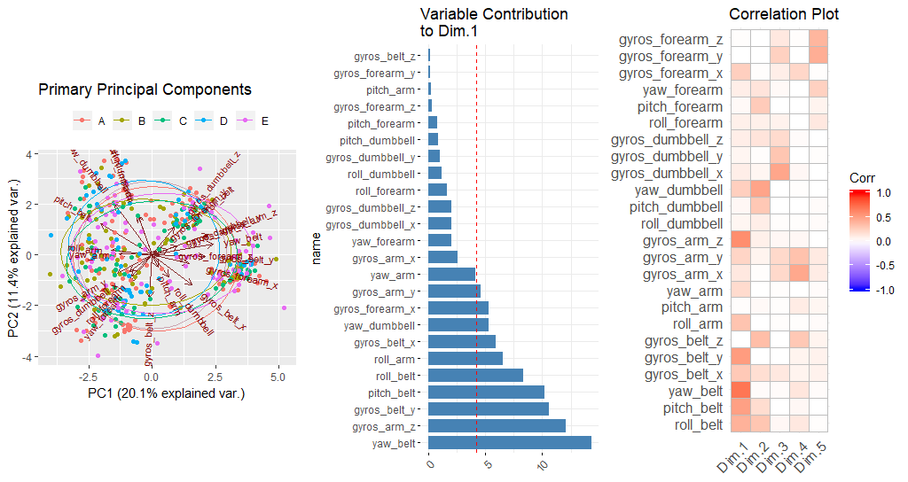

<!-- Override the code font to Fira Sans as it supports ligatures
     and add formatting for tables -->
<style type="text/css">
  body{ font-size: 12pt; }
  code.r{ font-size: 10pt; font-family: "Fira Code"  !important;}
  p{text-align: justify; }
  p.abstract{ display: none; }
  div.abstract {
    font-style: italic;
    font-size: 11pt;
    margin-left: 0pt;
    border-bottom: 1px solid;
    border-top: 1px solid;
    width:100% !important;
    text-align: justify;}
  h1.title {
    font-size: 22pt;
    color: DarkRed;
  }
  h1 { font-size: 18pt; }
  h2 { font-size: 16pt; }
  h3 { font-size: 14pt; }  
  h4.author, h4.date  { font-size: 11pt; }  
  table{
    text-align: center;
    margin: auto; }
  td,th{padding-right:12px;}
</style>

```{r setup, include=FALSE}
options(warn=-1)
knitr::opts_chunk$set(echo=F,fig.pos='H')
```

```{r warning=F,message=F}
library(tidyverse)
library(lubridate)
library(data.table)
library(dplyr)
library(caret)
library(pgmm)
library(rpart)
library(gbm)
library(forecast)
library(e1071)
library(factoextra)
library(FactoMineR)
library(ggbiplot)
library(ggcorrplot)
library(rattle)
library(rpart.plot)
library(kableExtra)
```

```{r  cache=T,warning=F,message=F,results='hide'}
testData <-
  data.table(fread("pml-testing.csv",header=T,strip.white=T,blank.lines.skip=T,
                   check.names=F,key=NULL,stringsAsFactors=F,na.strings="NA")) %>%
  select_if(is.double)

trainData <-
  data.table(fread("pml-training.csv",header=T,strip.white=T,blank.lines.skip=T,
                   check.names=F,key=NULL,stringsAsFactors=T)) %>%
  filter(new_window=="yes") %>%
  select_at(vars("classe",colnames(testData))) %>% na.omit %>%
  rename_at(vars("classe"),funs(str_replace(.,"classe","Outcome")))

trainPCA <- PCA(select_if(trainData,is.double),scale.unit=T,graph=F)

# Fit the models against training data
set.seed(1287)
modelRF <- train(Outcome~.,data=trainData,method="rf")
modelBOOST <- train(Outcome~.,data=trainData,method="gbm")
modelLDA <- train(Outcome~.,data=trainData,method="lda")
# Undertake model prodecition against test data
predictionRF <- predict(modelRF,testData)
predictionBOOST <- predict(modelBOOST,testData)
predictionLDA <- predict(modelLDA,testData)
```

# Introduction
The study of @vel2013 considers the classification of appropriate versus inappropriate methods of undertaking a variety of weight lifting exercises by classifying inertial sensor data into one of five classes; **A** being the 'correct' methodology, with erroneous activities classified as one of: **B** - throwing the elbows to the front, **C** - lifting the dumbbell only halfway, **D** - lowering the dumbbell only halfway and **E** - throwing the hips to the front. The task is to predict the efficacy of the exercise regime, given training data of known class methodology via a wide variety of inertial sensor data which may be used as predictors of determining the appropriateness of a subject's exercise in testing data. The test and training data are supplied as pre-sliced datasets.

It so happens that the sliced test and training data do not have a common structure and, furthermore, the outcome to be employed - the class designating the efficacy of the activity, does not appear in the test data. In modelling and predicting tasks, it is usual that the structure of the test and training data are *identical*, and such permits the determination of the accuracy of any prediction and an assessment of the out-of-process error as opposed to the in-process error. In this case, we cannot therefore assess the accuracy nor error inherent in any prediction against the testing data based upon a confusion matrix. Moreover, given the different structure based upon encoding of empty numerical fields in the test data being encoded as `""`, such are parsed as logical fields with a value of `NA`. 

This being the case, for this exercise, we adopt the unusual strategy of determining which columns in the test data exhibit valid numeric data and thereby only select these columns for the training data in order to build our classifiers. There is little point in building classifiers upon the 'richer' content of the training data when such column targets are no present in the test data.

# Parsing the Testing and Training Data
Given the foregoing considerations, we first parse the supplied training data and use the numeric columns available therein to apply a column filter against the training data whilst including in the training data our outcome variable, which we name `Outcome`, thus:
```{r echo=T,results='markup'}
testData <-
  data.table(fread("pml-testing.csv",header=T,strip.white=T,blank.lines.skip=T,
                   check.names=F,key=NULL,stringsAsFactors=F,na.strings="NA")) %>%
  select_if(is.double)
trainData <-
  data.table(fread("pml-training.csv",header=T,strip.white=T,blank.lines.skip=T,
                   check.names=F,key=NULL,stringsAsFactors=T)) %>%
  filter(new_window=="yes") %>%
  select_at(vars("classe",colnames(testData))) %>% na.omit %>%
  rename_at(vars("classe"),funs(str_replace(.,"classe","Outcome")))
```

Note that, in the event that training data columns are not filtered in this manner, there are many occurrences of `NA` in the training data which presence will compromise model efficacy as one is then required to either omit `NA` data from the training process or to estimate a replacement value - not necessarily a sensible approach. As it happens, with this column pre-selection, no `NA` data occurs in the training data, so the addition of the pipe to `na.omit` is superfluous.

## Principle Components Analysis of the Training Data
Having curtailed the data available in the training data, we should verify the importance of the remaining variables via a Principle Components Analysis (PCA). We may construct a PCA model via:
```{r echo=T,results='markup'}
trainPCA <- FactoMineR::PCA(select_if(trainData,is.double),scale.unit=T,graph=F)
```

Even though we have reduced the independent variables to 24 in the training data, the variable factor map is still visually uninformative with this number of variables. However, the individuals factor map - that is, row-oriented impact upon determining principle components, shows no evident principal component clustering. The following charts depict, from left-to-right, the primary principle components highlighted by our `Outcome` class (A,B,C,D,E), the contribution of our filtered variables to the primary dimension of the PCA components with a vertical line showing a threshold of significance (of contribution) of 4%, and a correlation plot for all variables with respect to the reduced dimensions of the data.  
```{r warning=F,message=F,results='hide'}
trainPCA2 <- prcomp(select_if(trainData,is.double),scale=T,center=T)
g1 <- ggbiplot(trainPCA2, obs.scale = 1, var.scale = 1, 
               groups = trainData$Outcome, ellipse = TRUE, 
               circle = TRUE) +
  scale_color_discrete(name = '') +
  theme(legend.direction = 'horizontal', 
        legend.position = 'top') + labs(title="Primary Principal Components")

g2 <- fviz_contrib(trainPCA2, choice = "var", axes = 1) + coord_flip() + 
  labs(title=str_wrap("Variable Contribution to Dim.1",22))
g3 <- ggcorrplot(trainPCA$var$cos2) + coord_flip() + labs(title="Correlation Plot")
```
```{r fig.width=5}
#grid.arrange(g1,g2,g3,nrow=1,ncol=3)
```

Given this significance of how relatively well the remaining 24 variable explain the variance in class outcome with no extreme bias in any one or more variable, we will conduct modelling using all of the variable terms encoded in the training data.

# Modelling & Prediction
Another aspect of the lack of presence of the outcome variable in the testing data is that we may not conduct a stacked analysis. Consequently, we instead choose to use three three algorithms to compare their outcomes individually. 

## Decision Tree
Given the foregoing PCA analysis, it is also helpful to construct a decision tree regarding potential outcome prediction based upon ranges of values undertaken via the variables in the test data. Such a decision tree is as follows:

```{r fig.align='center'}
modelRPART <- train(Outcome~.,data=trainData,method="rpart")
fancyRpartPlot(modelRPART$finalModel,sub="")
```

Given the lack of discrimination in principal components, this decision tree is not very specific - that is, despite what is shown, there are many of the 24 variables available whose values are not incorporated into a decision to traverse the tree the arrive at a distinct outcome. This is an indicator, in general, that outcome discrimination will not be highly accurate except in the instances where the depicted variable value ranges provide for node traversal.

## Modelling Algorithms 
We choose three algorithms; the Random Forest, Boosting and a Linear Discriminant Analysis (LDA). Note that the latter also undertakes dimension reduction steps in evaluating an optimal projection of outcome evaluation. It may, in this case, be considered better to use a Mixture Discriminant Analysis (MDA), however, given the lack of clustering exhibited (as in the foregoing figure) by the primary principal components, it is unlikely that an MDA analysis will produce any 'better' result than an LDA and, even then, the LDA outcome is likely to have limited ability in discriminating outcomes. Our selected models are evaluated thus:
```{r echo=T,results='markup',warning=F,message=F,eval=F}
set.seed(1287)
modelRF <- train(Outcome~.,data=trainData,method="rf")
modelBOOST <- train(Outcome~.,data=trainData,method="gbm")
modelLDA <- train(Outcome~.,data=trainData,method="lda")
```

## Predicting Outcomes for Test Data
For the evaluated models, we undertake prediction against out training data via:
```{r echo=T,results='markup',warning=F,message=F,eval=F}
predictionRF <- predict(modelRF,testData)
predictionBOOST <- predict(modelBOOST,testData)
predictionLDA <- predict(modelLDA,testData)
```

As discussed above, since the test data does not encode the *actual* outcome, we cannot now construct confusion matrices nor provide estimates of the out-of-process, predicted values for the test data. Nevertheless, we tabulate the predictions for each of the rows in the test data, and the in-process accuracy and variance for each of our models.

```{r}
predictions <- function(model){
  paste0("{",
         str_replace(
           purrr::reduce(model,~ paste(.x, .y, sep = ","), .init=""),
           "^[,]",""),"}") }
accuracies <- data.frame(Model=c("Random Forest","Boost","LDA"),
                         Outcomes = c(predictions(predictionRF),
                                                  predictions(predictionBOOST),
                                                  predictions(predictionLDA)),
                         Accuracy = c(round(max(modelRF$results$Accuracy)*100,2),
                                      round(max(modelBOOST$results$Accuracy)*100,2),
                                      round(modelLDA$results$Accuracy*100,2))) %>%
  dplyr::arrange(desc(Accuracy))
colnames(accuracies) <- c("Model","Predicted Test Data Outcomes","Accuracy %")
b <- modelBOOST$results[modelBOOST$results$Accuracy == max(modelBOOST$results$Accuracy),]
```

```{r}
kableExtra::kable(accuracies)
```

Note that for the Random Forest model, the best accuracy is yielded when the number of randomly selected variables was `r modelRF$bestTune$mtry` with a standard deviation in the accuracy of 
`r round(modelRF$results$AccuracySD[1],2)`. This result, alongside the decision tree, is highlighted by a plot of the decreasing importance of the variables used by the Random Forest model:  

```{r fig.align='center',warning=F,message=F,results='hide'}
# Save the variable importance values from our model object generated from caret.
x<-varImp(modelRF, scale = TRUE)

# Get the row names of the variable importance data
rownames(x$importance)

# Convert the variable importance data into a dataframe
importance <- data.frame(rownames(x$importance), x$importance$Overall)

# Relabel the data
names(importance)<-c('Measure', 'Importance')

# Order the data from greatest importance to least important
importance <- transform(importance, Measure = reorder(Measure, Importance))
```
```{r fig.align='center'}
# Plot the data with ggplot.
ggplot(data=importance, aes(x=Measure, y=Importance)) +
  geom_bar(stat = 'identity',colour = "blue", fill = "blue") + coord_flip()
```

Clearly `roll_belt` is a key indicator and it's likely that in the selection of two variables for optimal accuracy, if `roll_belt` is one, then many of the others can significantly contribute to improved accuracy.

For the boosted model, the reported, best accuracy of `r round(b$Accuracy*100,2)` has a standard deviation of `r round(b$AccuracySD,2)` and is achieved when considered `r b$n.trees` trees with a maximum interaction depth of `r b$interaction.depth`. For the LDA model, despite the standard deviation of the accuracy being reported as `r round(modelLDA$results$AccuracySD,2)`, it's clear that the linear partitioning of data given the visualisations to date, is unable to accurately discriminate such and predict a 'reasonable' outcome.

# References
